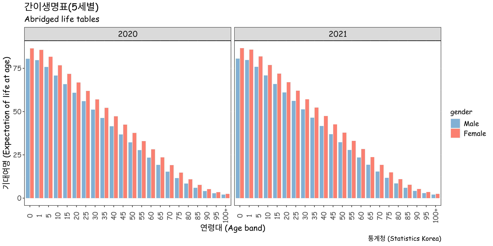

# kosis package

<!-- badges: start -->

[](https://cran.r-project.org/package=kosis) [](https://github.com/seokhoonj/kosis/actions/workflows/R-CMD-check.yaml)

<!-- badges: end -->

## Introduction

Korean Statistical Information Service (KOSIS Open API Service)\
(<https://kosis.kr/openapi/index/index.jsp>)

| Service View Code | Service View Name        |
|:------------------|:-------------------------|
| MT_ZTITLE         | 국내통계 주제별          |
| MT_OTITLE         | 국내통계 기관별          |
| MT_GTITLE01       | e-지방지표(주제별)       |
| MT_GTITLE02       | e-지방지표(지역별)       |
| MT_CHOSUN_TITLE   | 광복이전통계(1908\~1943) |
| MT_HANKUK_TITLE   | 대한민국통계연감         |
| MT_STOP_TITLE     | 작성중지통계             |
| MT_RTITLE         | 국제통계                 |
| MT_BUKHAN         | 북한통계                 |
| MT_TM1_TITLE      | 대상별통계               |
| MT_TM2_TITLE      | 이슈별통계               |
| MT_ETITLE         | 영문 KOSIS               |

## Installation

``` r
# install from CRAN
install.packages("kosis")

# install dev version
devtools::install_github("seokhoonj/kosis")  
```

## Example

``` r
library(kosis)

# set your api key
kosis.setKey(apiKey = "your_api_key")

# or permantly
usethis::edit_r_environ() # add KOSIS_API_KEY="your_api_key" in .Renviron

# get stat list
getStatList(vwCd = "MT_ZTITLE")
getStatList(vwCd = "MT_ZTITLE", parentListId = "F_29") # find table id of `life table`

# get stat data (Actuarial Life Table)
data <- getStatData(orgId = "101", tblId = "DT_1B42", objL1 = "ALL")
life_table <- castItem(statData = data, itemVar = "ITM_NM")
```

Example of plot using life table data from KOSIS 

## Usage

1.  `getStatList`, `getStatSearch`

-   `getStatList` finds orgId (organization ID) and tblId (table ID).
-   `getStatSearch` searches for the keyword you are looking for.

``` r
# get list id for searching tbl id
getStatList("MT_ZTITLE", parentListId = "F_29") # 국내통계 기관별
```

```         
      VW_CD           VW_NM ORG_ID  TBL_ID                       TBL_NM ...
1 MT_ZTITLE 국내통계 주제별    101 DT_1B41            간이생명표(5세별)
2 MT_ZTITLE 국내통계 주제별    101 DT_1B42            완전생명표(1세별)
3 MT_ZTITLE 국내통계 주제별    101 DT_1B43        사망원인생명표(5세별)
4 MT_ZTITLE 국내통계 주제별    101 DT_1B44     시도별 간이생명표(5세별)
5 MT_ZTITLE 국내통계 주제별    101 DT_1B45 시도별 사망원인생명표(5세별)
6 MT_ZTITLE 국내통계 주제별    101 DT_1B46          건강수준별 기대여명
...
```

``` r
# search directly by word to get the table ID
getStatSearch("생명표")
```

```         
   ORG_ID     ORG_NM         TBL_ID                              TBL_NM ...
1     101     통계청        DT_1B42                   완전생명표(1세별)
2     101     통계청        DT_1B41                   간이생명표(5세별)
3     101     통계청        DT_1B43               사망원인생명표(5세별)
4     101     통계청        DT_1B44            시도별 간이생명표(5세별)
5     101     통계청        DT_1B45        시도별 사망원인생명표(5세별)
...
```

2.  `getStatData`

-   downloads data using orgId (organization ID) and tblId (table ID).
-   Since we deal with the data layout of various organizations, we need to consider the variables of objL1 \~ objL8.
-   According to KOSIS, objL5\~8 are rarely required.
-   The mandatory option of objL is objL1 = "ALL".
-   When an error occurs (err: 20, errMsg: 필수요청변수값이 누락되었습니다. (objL)), change objL2 = "ALL".
-   If the error 20 occurs again, change objL3 = "ALL".
-   Repeat.

``` r
# default arguments: objL1 = "ALL", objL2 = "", objL3 = "", objL4 = "", ...
getStatData(orgId = "117", tblId = "DT_117N_A00124")

# If the error code is 20, change the objL2 variable
getStatData(orgId = "117", tblId = "DT_117N_A00124", objL2 = "ALL")

# If the error code is 20 again, change the objL3 variable
getStatData(orgId = "117", tblId = "DT_117N_A00124", objL2 = "ALL", objL3 = "ALL")

# If the error code is 20 again, change the objL4 variable
getStatData(orgId = "117", tblId = "DT_117N_A00124", objL2 = "ALL", objL3 = "ALL", objL4 = "ALL")
```

3.  `getStatDataFromURL`

-   downloads data from the url found on the KOSIS webpage below
-   <https://kosis.kr/openapi/devGuide/devGuide_0203List.jsp>

``` r
# or get stat data from URL (recommeded by KOSIS)
url <- "https://kosis.kr/openapi/Param/statisticsParameterData.do?method=getList&apiKey=&itmId=T6+T16+T26+T5+T15+T25+T2+T12+T22+T3+T13+T23+T4+T14+T24+T1+T11+T21+&objL1=00&objL2=&objL3=&objL4=&objL5=&objL6=&objL7=&objL8=&format=json&jsonVD=Y&prdSe=Y&newEstPrdCnt=3&prdInterval=1&orgId=101&tblId=DT_1B41"
getStatDataFromURL(url)
```

4.  `getStatExpl`, `getStatMeta`

-   `getStatExpl` explains user note, glossary of terms, history, etc.
-   `getStatMeta` explains the contents of the data.

``` r
getStatExpl(orgId = "101", tblId = "DT_1B42")
```

``` r
getStatMeta(orgId = "101", tblId = "DT_1B42", type = "TBL")
getStatMeta(orgId = "101", tblId = "DT_1B42", type = "ORG")
getStatMeta(orgId = "101", tblId = "DT_1B42", type = "PRD")
getStatMeta(orgId = "101", tblId = "DT_1B42", type = "ITM")
getStatMeta(orgId = "101", tblId = "DT_1B42", type = "CMMT")
```
